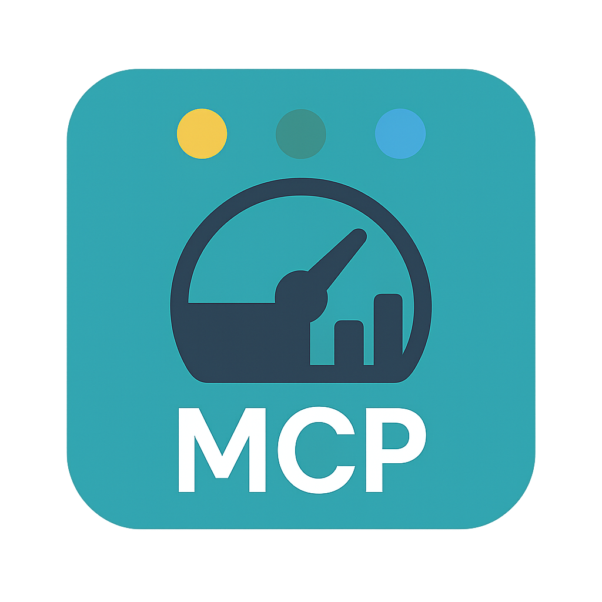

# MCP Dashboard

<p align="center">
  
</p>

A GUI dashboard for managing Claude Code and Claude Desktop MCP (Model Context Protocol) settings through a user-friendly web interface.

## Features

- **Claude Code Support**: Full support for Claude Code's MCP configuration (.mcp.json, ~/.claude.json)
- **VS Code MCP Support**: Configure VS Code MCP settings (.vscode/mcp.json, ~/.vscode/mcp.json)
- **Multi-Scope Configuration**: Manage project-level, user-level, and Claude Desktop configs
- **Easy Configuration**: Manage MCP servers through an intuitive web-based GUI
- **Preset Support**: Quick setup with pre-configured MCP server templates
- **Live Editing**: Add, edit, delete, and enable/disable MCP servers
- **Validation**: Built-in validation to ensure configuration correctness
- **Auto Backup**: Automatic backup before saving changes
- **Cross-Platform**: Works on macOS, Windows, and Linux

## Installation

```bash
npx mcp-dashboard
```

Or install globally:

```bash
npm install -g mcp-dashboard
mcp-dashboard
```

## Usage

### Basic Usage

Simply run the command to start the tool:

```bash
npx mcp-dashboard
```

This will:

1. Start a local web server (default port: 4000)
2. Automatically open your default browser
3. Load your current MCP configuration

### Command Line Options

```bash
mcp-dashboard [options]

Options:
  -p, --port <port>  Port number (default: 4000)
  --no-open          Do not open browser automatically
  -h, --help         Display help
  -V, --version      Display version
```

### Configuration File Locations

The tool automatically detects and prioritizes configuration files in the following order:

1. Project scope: `.mcp.json`
2. Cursor scope: `.cursor/mcp.json`
3. VS Code scope: `.vscode/mcp.json` (project) or `~/.vscode/mcp.json` (user)
4. User scope: `~/.claude.json`
5. Claude Desktop scope: platform-specific legacy path

#### Claude Code (Recommended)

**Project Scope** (`.mcp.json` in project directory):

- Searched upward from current directory to home directory
- Ideal for team-shared, version-controlled configurations
- Priority: **Highest**

**User Scope** (`~/.claude.json`):

- All platforms: `~/.claude.json` in home directory
- Personal settings shared across all projects
- May contain additional Claude Code settings (theme, projects, etc.)
- Priority: **Medium**

#### VS Code MCP

**Project Scope** (`.vscode/mcp.json` in project directory):

- Searched upward from current directory to home directory
- Works with VS Code MCP integrations
- Priority: **High**

**User Scope** (`~/.vscode/mcp.json`):

- Stored under `.vscode` in the home directory
- Useful for sharing VS Code MCP settings across projects
- Priority: **Medium-High**

#### Claude Desktop (Legacy Support)

**Claude Desktop Config**:

- **macOS**: `~/Library/Application Support/Claude/claude_desktop_config.json`
- **Windows**: `%APPDATA%/Claude/claude_desktop_config.json`
- **Linux**: `~/.config/Claude/claude_desktop_config.json`
- Priority: **Lowest** (backward compatibility)

The tool displays the active configuration file and its scope (Project/User/Claude Desktop) in the header.

## Managing MCP Servers

### Adding a Server

1. Click "Add Server" button
2. Enter server details:
   - Server name (unique identifier)
   - Command (e.g., `npx`)
   - Arguments (e.g., `-y`, `@modelcontextprotocol/server-filesystem`)
   - Environment variables (optional)
3. Click "Save"

### Using Presets

1. Click "Add from Preset"
2. Search or browse available presets
3. Click "Add" on desired preset
4. Customize configuration if needed
5. Click "Save"

### Available Presets

- **Filesystem MCP**: Access local files and directories
- **Git MCP**: Git repository operations
- **GitHub MCP**: GitHub API integration
- **Brave Search MCP**: Web search capabilities
- **PostgreSQL MCP**: PostgreSQL database operations
- **SQLite MCP**: SQLite database operations
- **Puppeteer MCP**: Browser automation
- **Slack MCP**: Slack workspace integration

### Editing a Server

1. Click "Edit" on the server card
2. Modify configuration
3. Click "Save"

### Deleting a Server

1. Click "Delete" on the server card
2. Confirm deletion

### Enabling/Disabling a Server

Click the checkbox next to the server name to toggle enabled/disabled state.

## Development

### Setup

```bash
# Clone the repository
git clone https://github.com/ogison/mcp-dashboard.git
cd mcp-dashboard

# Install dependencies
npm install

# Build the project
npm run build
```

### Development Mode

```bash
# Run both server and client in watch mode
npm run dev

# Or run them separately
npm run dev:server  # Backend
npm run dev:client  # Frontend
```

### Project Structure

```
mcp-dashboard/
├── bin/
│   └── cli.js              # CLI entry point
├── src/
│   ├── server/             # Backend (Express)
│   │   ├── index.ts
│   │   ├── routes/
│   │   ├── services/
│   │   ├── utils/
│   │   └── types/
│   ├── client/             # Frontend (React + Vite)
│   │   ├── src/
│   │   │   ├── components/
│   │   │   ├── hooks/
│   │   │   ├── services/
│   │   │   ├── types/
│   │   │   └── App.tsx
│   │   └── index.html
│   └── presets/
│       └── mcpServers.json # Preset definitions
└── dist/                   # Build output
```

### Tech Stack

**Backend:**

- Node.js + TypeScript
- Express
- CORS, Body Parser

**Frontend:**

- React 18
- Vite
- TailwindCSS
- React Hook Form
- Zod (validation)

**CLI:**

- Commander (CLI framework)
- Chalk (colored output)
- Open (browser launcher)

## Security

- **Localhost Only**: Web server binds to localhost only
- **Input Validation**: Strict validation of all user inputs
- **Path Safety**: Protection against path traversal attacks
- **Auto Backup**: Configuration backed up before changes

## Troubleshooting

### Port Already in Use

If port 4000 is already in use:

```bash
mcp-dashboard -p 62000
```

### Browser Doesn't Open

If the browser doesn't open automatically:

```bash
mcp-dashboard --no-open
```

Then manually open: `http://localhost:4000`

### Configuration Not Found

If your configuration file isn't detected, ensure Claude Code is installed and has been run at least once to create the config file.

## License

MIT

## Contributing

Contributions are welcome! Please feel free to submit a Pull Request.

## Support

For issues and feature requests, please visit:
https://github.com/ogison/mcp-dashboard/issues
